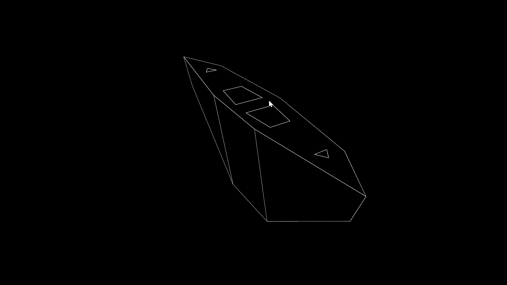
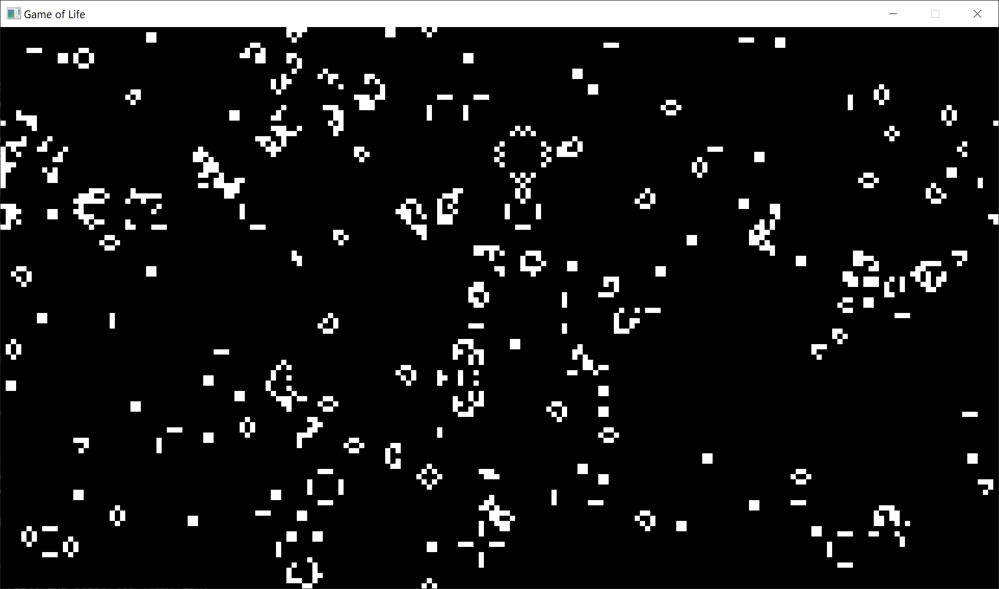
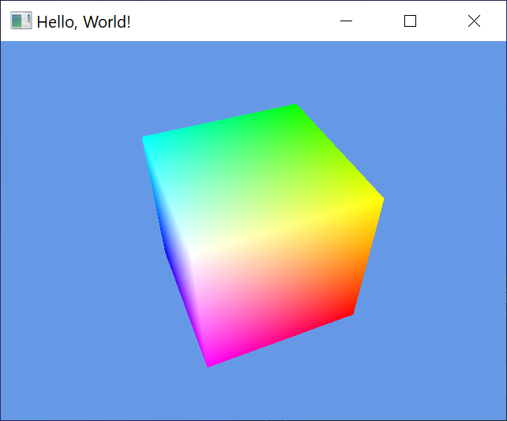
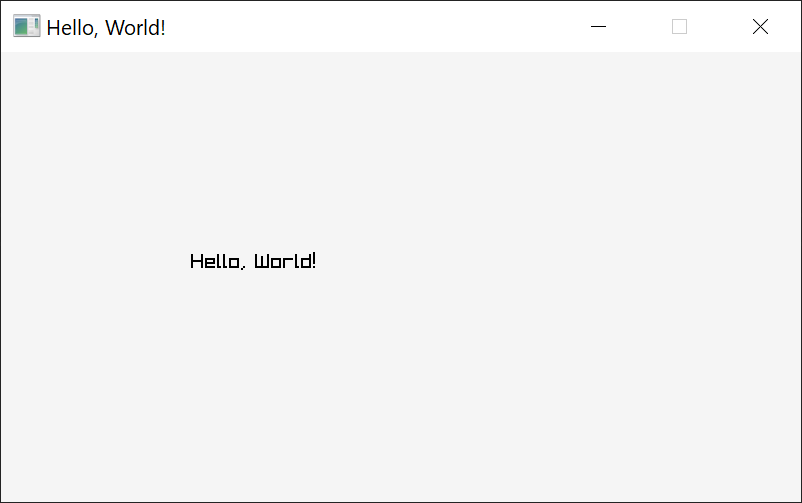
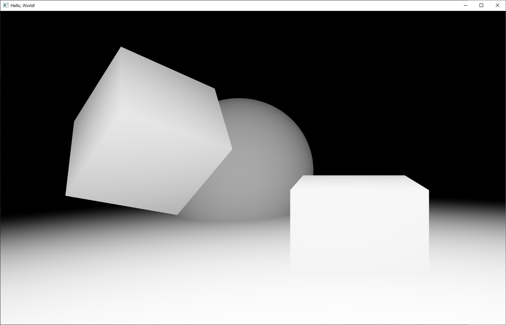

# Games

This repo houses some small experiments using C++ & Raylib.

## Contents
- [Games](#games)
  - [Contents](#contents)
  - [Prerequisites](#prerequisites)
  - [Environment](#environment)
  - [Cobra](#cobra)
  - [Game of Life](#game-of-life)
  - [GLFW](#glfw)
  - [Hello World](#hello-world)
  - [Raymarching](#raymarching)

## Prerequisites

_Note: This repository currently only works on Windows. I intend to also support Linux & MacOS in the future._

- [Bazel](https://docs.bazel.build/versions/master/install-windows.html)
- [VC++ Redist](https://www.microsoft.com/en-us/download/details.aspx?id=48145)
- [Build Tools for Visual Studio 2019](https://aka.ms/buildtools)

## Environment

Bazel should be present in `PATH`, and `BAZEL_VC` should be set to your the VC directory of VS2019 Build Tools, it will likely be `C:\Program Files (x86)\Microsoft Visual Studio\2019\BuildTools\VC`.

## Cobra

```
$ bazel run //examples/cobra --enable_runfiles
```



## Game of Life

```
$ bazel run //examples/game_of_life
```



## GLFW

```
$ bazel run //examples/glfw --enable_runfiles
```



## Hello World

```
$ bazel run //examples/hello_world
```




## Raymarching

```
$ bazel run //examples/raymarching --enable_runfiles
```


